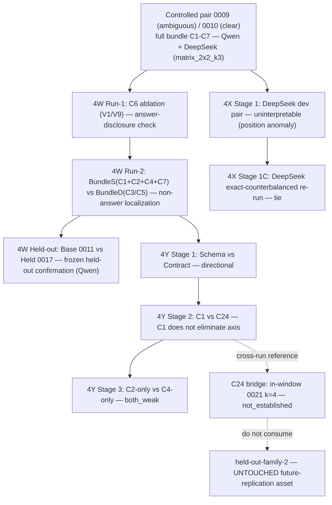

# Phase-4Z — Paper Figures & Tables (generated, no paid calls)

**Source:** every numerical entry is read from the committed report JSON (`reports/synthetic_p14_balanced_controlled_pair.json` → `matrix_2x2_k3`) or re-derived from the preserved episode ledgers (`reports/evidence/p14_phase4*_episodes/<trial>/flow_config.submitted.json` + `result.json` + `agentlog.sanitized.json`) by `scripts/phase4z_figures_tables.py`. No number is hand-copied.

## Figure 1 — End-to-end study design



## Table 1 — Claim–Evidence Hierarchy (three-tier separation)

| Tier | Claim | Status | Scope | Decisive evidence |
|---|---|---|---|---|
| **1. Full clarity bundle (0010, incl. answer-bearing C6)** | suppresses semantic-binding failures on the controlled pair | **Established** | Qwen + DeepSeek, original pair | matrix_2x2_k3: Qwen 0010 3/3 (0 axis); DeepSeek 0010 3/3 (0 axis) |
| 1 | complete-bundle effect, NOT isolated cross-model evidence for BundleS | scope note | — | BundleS excludes C6 (Tier 2) |
| **2. Non-answer BundleS (C1+C2+C4+C7)** | suffices on dev + generalizes to pre-frozen held-out | **Established (Qwen)** | Qwen dev + held-out | 4W Run-2 BundleS 3/3; Held 0017 3/3 |
| 2 | no detectable benefit under exact counterbalancing | **Negative** | DeepSeek | 4X Stage 1C Base 3/4 = BundleS 3/4 |
| 2 | model-contingent mechanism candidate | scope note | — | Qwen yes / DeepSeek not established |
| **3. Minimal components** | C1, C2, C4, C7 individually stable | **Negative/Unresolved** | Qwen, k=3-4 | C1 2/4 (2 axis); C2 1/4; C4 0/4; Schema 2/3; Contract 1/3 |
| 3 | C2×C4 joint-effect confirmed | **Unresolved** | — | C24 cross-run 3/4 (0 axis) but in-window bridge 2/4 (1 axis) → not_established |
| 3 | C24 is a confirmed interaction / minimal mechanism | **Not claimed** | — | bridge failed the predeclared threshold |

*Matrix authoritative; prose must not outrun a row.*

## Table 2 — Model × Mechanism Result Matrix (typed-binding correct / k, with axis failures)

Cells = `correct/k (axis_fails)`. `—` = not run. Generated from ledgers + controlled-pair JSON.

| mechanism | Qwen | DeepSeek | source |
|---|---|---|---|
| Base(0009) | 1/3 (2 axis) | 0/3 (3 axis) | Qwen:controlled_pair_json, DeepSeek:controlled_pair_json |
| Full bundle(0010) | 3/3 (0 axis) | 3/3 (0 axis) | Qwen:controlled_pair_json, DeepSeek:controlled_pair_json |
| BundleS | 3/3 (0 axis) | 3/4 (1 axis) | Qwen:ledger, DeepSeek:ledger |
| BundleD | 1/3 (2 axis) | — | Qwen:ledger |
| Base | 1/3 (1 axis) | — | Qwen:ledger |
| Held(0017) | 3/3 (0 axis) | — | Qwen:ledger |
| Schema | 2/3 (0 axis) | — | Qwen:ledger |
| Contract | 1/3 (2 axis) | — | Qwen:ledger |
| C1 | 2/4 (2 axis) | — | Qwen:ledger |
| C24(xrun) | 3/4 (0 axis) | — | Qwen:ledger |
| C24(bridge) | 2/4 (1 axis) | — | Qwen:ledger |
| C2 | 1/4 (3 axis) | — | Qwen:ledger |
| C4 | 0/4 (3 axis) | — | Qwen:ledger |

## Figure 2 — Failure Taxonomy (program-wide, ledger-derived)

```
semantic_binding_failure (signoff-green / typed-rejected)
  ├─ axis_binding_failure        (value on wrong typed axis, e.g. func/slow)
  │    program total: 20 episodes
  └─ role_conditioned_value_selection_failure (type-valid, wrong value, e.g. typ/func, slow/test)
       program total: 5 episodes
correct typed binding: 29 episodes (of 54 ledger-derived)
```

## Figure 3 — Reliability Layers (seven independent dimensions)

Each layer is reported separately; none is collapsed into another. Denominators are ledger episodes whose preserved logs carry that dimension (the controlled-pair cells carry only binding counts, so they enter layer 1 but not layers 2–5).

```
1. Semantic binding                29/54 correct
2. Artifact correctness            21/42 score==1.0
3. Protocol completion             16/42 voluntary FINISH
4. Terminal transport validity     30/42 terminal-valid
5. Recovered degradation           5/42 with recovered transport degradation
6. Tool health                     b04/PT sentinel + Level-2 full-path check; block measurement-control admissible iff both bookends healthy
7. Source-tree integrity           canonical-tree guard: isolated exact-commit worktree, frozen SHA-256, canonical non-writable, per-episode verify; 0 integrity incidents in the guarded C24 bridge
```

*Layers 1–5 are ledger-derived (denominator = episodes whose sanitized logs carried the field); layers 6–7 are infrastructure status.*

