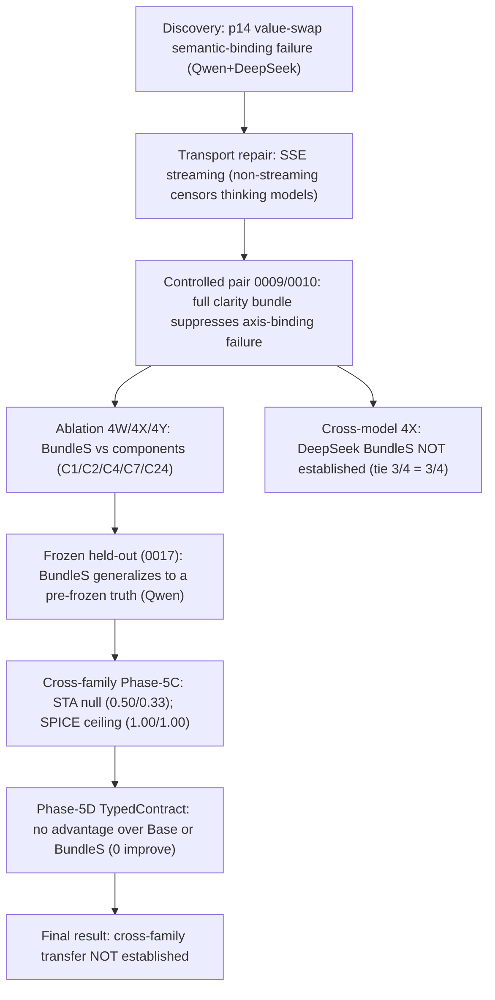

# Phase-6 Figures & Tables (generated, no model calls)

**Source:** every number is read from `reports/evidence/phase6_data.json` (which reads committed JSON/ledgers + re-runs the p14 figures generator). No hand-copying.

## Figure 1 — Study pipeline



## Table 1 — Main result matrix (semantic-binding correct / k; directional)

Cells = semantic_binding correct rate. `—` = not run.

| Family | Model | Base | BundleS | TypedContract | Phase |
|---|---|---|---|---|---|
| p14 workflow-handoff | Qwen | 1/3 (0009) | 3/3 (0010) | — | 4U/4V confirmatory |
| p14 workflow-handoff | Qwen (held-out 0017) | 1/3 (0011) | 3/3 (0017) | — | 4W frozen held-out |
| p14 workflow-handoff | DeepSeek | 3/4 (1C) | 3/4 (1C) | — | 4X cross-model null |
| Family A (STA/PT) | Qwen | 0.5 | 0.333 | 0.333 | 5C/5D cross-family |
| Family B (SPICE/HSPICE) | Qwen | 1.0 | 1.0 | 1.0 | 5C/5D cross-family |

*p14 program: 58 primary episodes; Phase-5C/5D: 24+36 = 60 episodes.*

## Figure 2 — Semantic-binding failure taxonomy

```
semantic_binding_failure (signoff-green / measurement-plausible, typed-rejected)
  ├─ axis_binding_failure        (value on wrong typed axis; p14: 20 episodes)
  └─ role_conditioned_value_selection_failure (type-valid, wrong value; p14: 5 episodes)
       ├─ Family A (STA): coverage_cell_mismatch, authority_unattested_binding
       └─ Family B (SPICE): corner_authority_misbind, load_authority_misbind, metric_role_misbind
correct typed binding: 29 p14 episodes (of 54 ledger-derived)
```

## Figure 3 — Evaluation-validity stack (nine independent layers)

Each reported separately; none collapsed into a single score.

```
1. Semantic binding          (typed binding == golden; the primary outcome)
2. Artifact correctness      (weighted component score; e.g., provenance/coverage/sim)
3. Protocol completion       (voluntary FINISH vs task-wall/action-cap)
4. Terminal transport validity (no unrecovered transport failure; SSE streaming)
5. Recovered degradation     (>=1 recovered failed attempt; gradeable, not replaced)
6. Tool health               (PT/HSPICE sentinel + full-path bookends)
7. Sample-membership arbitration (episode_arbiter; measurement_valid = transport AND gradeable)
8. Action-surface integrity  (immutable core / derived deck; anti-cheat; hidden isolation)
9. Canonical-tree integrity  (exact-commit worktree; cig.freeze/verify; FAILED_INTEGRITY stop)
```

## Table 2 — External-validity summary

| Family | Model | BundleS vs Base | TypedContract vs Base | TypedContract vs BundleS | Verdict |
|---|---|---|---|---|---|
| STA (A) | Qwen | 0/6 improve | 0/6 improve | 0/6 improve | **Null** (Base 0.50 ≥ BundleS 0.33 = TC 0.33) |
| SPICE (B) | Qwen | ceiling (1.00) | ceiling (1.00) | ceiling (1.00) | **Ceiling** (non-discriminative) |
| Composite | — | 0 improve | 0 improve | 0 improve | **Transfer not established** |


*Costs: p14 ¥682.25 + Phase-5C ¥7.7225 + Phase-5D ¥11.7524 = total ¥701.72*

