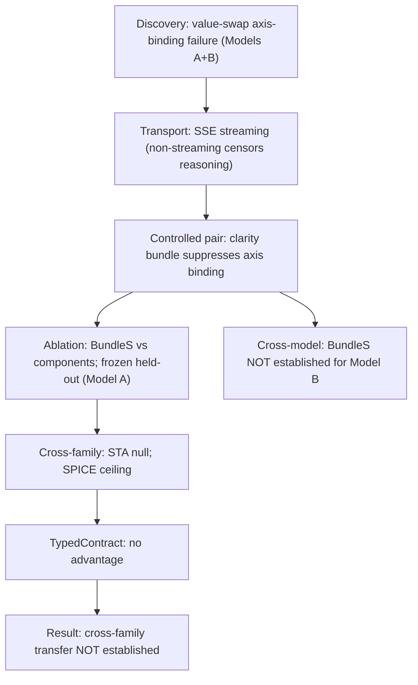

# Abstract

A harness intervention—the way a task presents its evidence and disambiguating context to an agent—can survive repeated development experiments and a pre-frozen within-family held-out test, yet disappear under a new model or a new semantic task family. We study this phenomenon on tool-grounded EDA workflows. On a controlled *semantic-handoff* task, a non-answer-bearing "clarity bundle" (**BundleS**: canonical role labels, value-domain definitions, a glossary, a procedural contract—no golden values) suppresses a specific semantic-axis binding failure for one frontier model, and this effect replicates on a pre-frozen held-out instance. Under exact counterbalancing the benefit is *not established* for a second model; on two structurally independent task families it is a clean null in one family and non-discriminative at ceiling in the other; a machine-readable typed representation of the same non-answer-bearing information adds no measurable advantage. The central finding is that **within-family held-out confirmation did not imply cross-model or cross-family transfer.** Because each of these conclusions could be manufactured or masked by an evaluation artifact, we additionally contribute a reusable **Harness Effect Audit Protocol**—four layers (capability validity, sampling validity, execution validity, artifact integrity) operationalized as nine independent measurement controls—each of which we show catching a real threat that would otherwise have altered interpretation. Our controlled instances test existence, recurrence, and transfer direction rather than estimate population-level pass rates. The contribution is an evaluation study of harness effects, not a proposal of an improved harness.

# 1. Introduction

> A harness intervention can survive repeated development experiments and a pre-frozen within-family held-out test, yet disappear under a new model or new semantic task family.

This is the result that motivates the paper. It is uncomfortable for agent evaluation: a measured effect that looks robust under repeated within-condition replication and even under a frozen held-out instance can still fail the first strict external-validity test. If the community takes a single within-family replication as evidence that a harness improvement "works," it will systematically over-credit interventions that are model- or family-specific.

We study this on tool-grounded EDA (electronic design automation) workflows, where an LLM agent reads heterogeneous task evidence, binds quantities to canonical typed roles, and submits an artifact to a real commercial tool for signoff. We focus on a *semantic-handoff* task: the agent must assign a tuple of values to canonical typed roles (e.g., place a PVT descriptor on the correct typed axis), where the visible evidence uses misleading role vocabulary. A wrong binding is not a syntax error—it produces a *plausible green signoff or plausible numeric output* on the real tool. Only a typed provenance/authority grader distinguishes a correct binding from a wrong one. This makes the task a clean instrument for studying whether harness information structure changes *semantic execution behavior* as opposed to mere tool success.

We do not propose a universally better harness. We ask three questions:

- **RQ1.** Can harness information structure change semantic execution behavior?
- **RQ2.** Does an observed harness effect transfer across models and task families?
- **RQ3.** Which evaluation controls are required for those conclusions to be scientifically valid?

In brief: (RQ1) yes—within a family a non-answer-bearing clarity bundle suppresses a specific axis-binding failure for one model, confirmed on a pre-frozen held-out instance; (RQ2) this does not imply transfer—it is not established for a second model under counterbalancing and is a clean null or a ceiling on two independent families; (RQ3) the conclusions depend on transport, tool health, sample-membership arbitration, protocol completion, action-surface, and canonical-source integrity, each able to manufacture or mask a result.

**Why this matters.** Benchmarks establish that harness configuration affects agent performance, but not *when* a measured effect is attributable to the disclosed information rather than a measurement artifact, *whether* it survives strict external-validity tests, or *which* controls are load-bearing. We show that an effect surviving pre-frozen within-family held-out evaluation may still fail cross-family transfer, and that the credibility of both the positive and the null conclusion rests on controls prior harness work does not report.

**Contributions.**

1. A controlled *semantic-binding* mechanism with a typed failure taxonomy, isolated from analog-design difficulty: the failure (placing a value on the wrong typed axis) stays tool-green and is rejected only by a typed provenance/authority grader.
2. The *external-validity-failure-after-held-out-confirmation* finding: a within-family effect confirmed on a pre-frozen held-out instance did not transfer across model or across two structurally independent families; a machine-readable typed representation of the same information added no advantage.
3. A reusable **Harness Effect Audit Protocol**—four layers, nine controls—each shown catching a real threat to the headline interpretation, contributed as a first-class methodological artifact rather than an implementation footnote.

The paper is organized as three studies mapped to the three questions (Study I: RQ1; Study II: RQ2; Study III: RQ3), preceded by problem formulation and methodology. The repository chronology (an extended sequence of internally gated development stages) is reported in the appendix as a provenance record; it does not structure the main paper.

# 2. Related Work and Problem Formulation

**Harnesses and harness effects.** We define a *harness* as the task-level information structure visible to the agent: the prompt, the visible task files, the disclosure bundle, the public tool feedback, and the action surface (the files the agent is permitted to edit). A *harness effect* is a change in agent behavior—specifically, semantic-binding correctness—attributable to a change in harness *information content*, holding the hidden truth, the grader, and the tool fixed.

**Problem formulation: the semantic handoff.** Each task presents a *semantic handoff*: the agent must bind a tuple of values to canonical typed roles drawn from heterogeneous, role-misleading evidence. Formally, the agent must recover a binding $\beta = (r_1{\,=\,}v_1,\dots,r_m{\,=\,}v_m)$ over canonical typed roles $\{r_j\}$ from evidence whose surface role vocabulary is deliberately inconsistent with the canonical roles. The three families instantiate this abstractly:

- *Workflow-handoff family:* bind PVT descriptors to typed axes (e.g., distinguish `scenario` from `corner`).
- *Family A (STA/PrimeTime):* bind (intent_class, target_partition, check_mode) from an authority provenance DAG.
- *Family B (SPICE/HSPICE):* bind (corner, load_condition, metric) from a request–authority relational join.

The families share none of the workflow family's signature structures (independent text templates, role vocabularies, hidden-truth representations, grader implementations, and decoy-generation logic); operational independence was verified under five pre-registered structural criteria (Appendix D). We treat this as operational independence, not as a proof.

**Positioning.** Prior work establishes that harness configurations affect agent performance. We instead study *when* a measured harness effect is scientifically attributable, *whether* it survives increasingly strict external-validity tests, and *which* execution-layer controls are required to support that conclusion. Table 2 sharpens this distinction across five lines of related work.

| Prior work (paraphrased) | What it establishes | What this paper additionally does |
|---|---|---|
| **Harness-Bench** | Broad model × harness characterization; harnesses matter at scale | Controlled semantic-mechanism isolation + typed taxonomy; claim-validity (transport, membership, integrity) |
| **Rethinking the Evaluation of Harness Evolution** | Critiques harness-leaderboard conflation; search/optimization and benchmark overfitting | Shows that even a *manually controlled* effect surviving pre-frozen within-family held-out evaluation may fail *cross-family* transfer |
| **HarnessOpt-Bench** | Optimizer *capability* over harness configurations | Studies the *validity* of harness-effect claims, not harness optimization |
| **ABC / Best-Practices in Agentic Benchmarks** | Benchmark setup; shortcut and reward validity | Additionally audits transport, recovered degradation, sample membership, tool health, action surfaces, and canonical-source integrity during execution |
| **Protocol-validity work on agent benchmarks** | Protocol design and reward-hacking surface | Treats measurement validity as the contribution; reports each control that *manufactured or masked* a result |

Table 2: *Positioning.* Our novelty is not "harnesses matter." It is (i) a controlled semantic-binding mechanism with a typed failure taxonomy, (ii) the external-validity-failure-after-held-out-confirmation finding, and (iii) measurement-validity auditing as a first-class, reusable protocol.

# 3. Harness Effect Audit Methodology

**Tasks and tool grounding.** All three families run on real commercial tools (PrimeTime for the workflow and STA families; HSPICE for the SPICE family) through a transparent remote execution shim to a compute server hosting the tools—*not* simulations of tools. A wrong binding produces a plausible green signoff (STA) or a plausible numeric measurement (SPICE), so tool success is necessary but not sufficient for semantic correctness; only the typed provenance/authority grader rejects a wrong binding. This property is the construct that lets us separate *semantic execution behavior* from *tool success*.

**Conditions.** Three conditions differ only in disclosure representation; hidden truth and grader are identical across conditions.

- **Base:** ambiguous natural-language handoff; no answer-bearing disclosure.
- **BundleS:** canonical role labels (C1), disjoint-axis value-domain definitions (C2), a glossary with references (C4), and a procedural contract (C7)—mapped mechanically from the frozen treatment specification; *no* answer-bearing assertion (no C6); *no* golden values.
- **TypedContract:** the same information content as BundleS rendered as a machine-readable JSON Schema; no golden values; no post-submission verifier feedback; matched budgets.

**Design.** Seeded exact-counterbalanced blocked randomization, frozen before any paid call. Instance is the primary experimental unit; stochastic repetitions are nested observations; we report paired directions and raw counts per instance and do not pool trajectories into a single significance headline. Predeclared interpretation tables govern each contrast (Appendix B). We do not claim population-level rates from small instance counts.

**Budget and replacement.** Committed-ledger budgets: ¥315 ceiling (Phase-5C core) and a recomputed ¥50.76 ceiling (Phase-5D secondary, derived from the observed per-slot cost of the core). Replacement is *validity-only*: an episode may be replaced only if it is terminally measurement-invalid; recovered degradation within an otherwise gradeable episode does *not* trigger replacement. This rule is what keeps a hard-but-recovered attempt from being silently discarded.

**Study registration.** Sequential adaptation—the design adapting to favorable outcomes—is a central concern for multi-stage agent research. Table 3 records the registration type of each result; only the predeclared, frozen-held-out, exact-counterbalanced, and cross-family-confirmatory results are headline.

| Registration type | Result (used in) | Headline? |
|---|---|---|
| Predeclared (controlled pair) | Workflow family: full clarity bundle suppresses axis binding (Study I) | Yes |
| Frozen-held-out confirmatory | Workflow family: BundleS on a pre-frozen held-out truth (Study I) | Yes |
| Exact-counterbalanced | Cross-model: BundleS vs Base under balanced blocking (Study II) | Yes |
| Cross-family confirmatory | STA null + SPICE ceiling on pre-registered families (Study II) | Yes |
| Secondary extension (pre-frozen) | TypedContract, separately frozen budget (Study II) | Yes (scoped) |
| Exploratory (sequential) | Component localization C1/C2/C4/C7/C24 (Study I, one sentence; Appendix A) | No |

Table 3: *Study registration.* The headline claims rest on predeclared, frozen-held-out, exact-counterbalanced, and cross-family-confirmatory evidence. Exploratory mechanism localization is reported as exploratory and is not a headline. This table directly answers the sequential-adaptation concern.

**Measurement as a first-class object.** We preview the four-layer protocol here (Figure 3) and instantiate it in Study III: (1) capability validity, (2) sampling validity, (3) execution validity, (4) artifact integrity. Every episode in every headline cell passed all four layers; the layers that *caught threats* during development are the methodological contribution.

**Figure 1 — Study/evidence pipeline** (the three studies, the registration of each step, and where the central finding crystallizes).



# 4. Study I — Controlled Semantic-Binding Effects (RQ1)

*Question:* can harness information structure change semantic execution behavior, holding truth and grader fixed?

**Discovery (predeclared controlled pair).** We construct a controlled pair that shares identical hidden truth and grader and differs only in the disclosure bundle: an *ambiguous* handoff versus a *clear* handoff that adds the full clarity bundle. On the real tool, both versions accept a green signoff regardless of binding correctness. The full clarity bundle suppresses the axis-binding failure for *both* providers: one model moves from 1/3 (2 axis-binding) to 3/3 (0 axis-binding), the other from 0/3 (3 axis-binding) to 3/3 (0 axis-binding). This establishes that the disclosure, not the tool and not the hidden truth, is the operative variable (RQ1: *established*).

**The failure that the bundle suppresses (Figure 2).** Across the workflow-family program ledger (54 primary episodes), the typed grader partitions outcomes into 29 correct typed bindings, 20 *axis-binding* failures (a value placed on the wrong typed axis—e.g., `scenario=func` instead of `corner=func`), and 5 *role-conditioned value-selection* failures (type-valid, wrong value). The axis-binding subtype is exactly the failure the clarity bundle targets: it is syntactically legal, tool-green, and semantically wrong. Family-specific subtypes (coverage-cell mismatch and authority-unattested binding for STA; corner/load/metric authority misbind for SPICE) extend the taxonomy to the external families.

**Figure 2 — Semantic-binding failure taxonomy** (tool-green / measurement-plausible outcomes rejected only by the typed grader).

```
semantic_binding_failure          (green signoff / plausible number; typed-rejected)
  - axis_binding_failure              (value on wrong typed axis)      20 / 54
  - role_conditioned_value_selection  (type-valid, wrong value)         5 / 54
      - STA:   coverage_cell_mismatch, authority_unattested_binding
      - SPICE: corner / load / metric authority_misbind
correct typed binding: 29 / 54
```

**Non-answer localization.** The full bundle includes an answer-bearing assertion component (C6). To establish that the operative information is *non-answer-bearing*, we exclude C6 and test the schema/contract subset BundleS (C1+C2+C4+C7: labels, value-domain definitions, glossary, contract). On the development pair, BundleS alone suffices for the responsive model (BundleS 3/3 vs the decoy-disambiguation bundle **BundleD** = C3+C5, which scores 1/3 and reproduces two wrong-axis bindings). The effect is therefore attributable to the non-answer-bearing schema/contract disclosure—neither to leaking the answer (C6) nor to disambiguating decoys (C3/C5).

**Pre-frozen held-out confirmation.** Generalization within the family is tested on a held-out instance whose hidden truth was frozen *before* the disclosure mapping was selected: the BundleS mapping applied to the held-out truth yields 3/3 correct vs Base 1/3 on the matched Base instance (frozen-held-out confirmatory). This is the strongest within-family evidence and the stepping-off point for external validity.

**Model contingency (motivates Study II).** Under exact counterbalancing on a second model, BundleS is *not established*: Base 3/4 (1 axis-binding) equals BundleS 3/4 (1 axis-binding). The within-family benefit is model-contingent rather than universal—a result we return to in Study II.

**Component decomposition (exploratory; not headline).** A sequential exploratory decomposition tested whether a stable minimal component underlies BundleS. No stable minimal component was identified; the fine-grained C1/C2/C4/C7/C24 results (including a predeclared in-window C24 bridge that failed its ≥3/4-with-0-axis threshold) are reported in Appendix A and do not bear a headline claim. We state only that the bundle-level effect is real within the family for the responsive model while a stable sub-component was not isolated.

The within-family story (Table 1, workflow rows): a non-answer-bearing disclosure suppresses a specific tool-green semantic failure, replicates on a pre-frozen held-out instance, but is already model-contingent under counterbalancing.

# 5. Study II — Model and Cross-Family External Validity (RQ2)

*Question:* does the within-family effect transfer across models and across structurally independent task families?

This study is where the paper's central finding lives. We test transfer along two axes—*model* (a second frontier model under exact counterbalancing) and *family* (two structurally independent semantic-handoff families). The result is visible immediately in Table 1.

**Table 1 — Main result matrix (semantic-binding correct rate; instance is the unit).**

| Family | Model | Base | BundleS | TypedContract | Registration |
|---|---|---|---|---|---|
| Workflow-handoff (development pair) | Model A | 1/3 (2 axis) | 3/3 (0 axis) | — | Predeclared |
| Workflow-handoff (frozen held-out) | Model A | 1/3 (Base instance) | 3/3 (held-out) | — | Frozen held-out |
| Workflow-handoff | Model B | 3/4 (1 axis) | 3/4 (1 axis) | — | Exact-counterbalanced |
| Family A — STA / PrimeTime | Model A | 0.50 | 0.33 | 0.33 | Cross-family |
| Family B — SPICE / HSPICE | Model A | 1.00 | 1.00 | 1.00 | Cross-family |

*Cells are semantic-binding correct rates. `—` = not run. Instance is the unit; repetitions are nested. The development and held-out cells are paired controlled instances; the STA and SPICE cells are means over three instances (two nested repetitions each).*

**Cross-model (within family).** Under exact counterbalancing, the within-family BundleS benefit is not established for Model B (tie 3/4 = 3/4): the effect that replicated on the frozen held-out instance for Model A does not reproduce under balanced blocking.

**Cross-family.** On two structurally independent families, also evaluated with Model A (the model for which the within-family effect *was* established), the result splits into two distinct kinds of null that we keep separate:

- **Family A (STA) — a clean null.** Across three instances, BundleS does not improve over Base (0/3 instances improve; one declines from 0.50 to 0.00, one ties at ceiling 1.00, one ties at floor 0.00). Family means: Base 0.50, BundleS 0.33, TypedContract 0.33. This is primary evidence of non-transfer: on a family for which the measurement is discriminating, the disclosure that helped within the workflow family does not help here.

- **Family B (SPICE) — non-discriminative at ceiling.** Base already solves the semantic binding on all three instances (1.00), so BundleS and TypedContract also sit at 1.00. This is not evidence that the effect was *refuted*; it is evidence that the effect is *unmeasurable* on this family because the Base condition leaves no room to improve. We therefore do not merge the STA null and the SPICE ceiling into a single "no transfer" claim: one is a clean null, the other is a measurement ceiling.

**Typed representation adds nothing.** The TypedContract condition renders the same non-answer-bearing information as BundleS in a machine-readable JSON Schema. Across the six external instances, TypedContract produces no measurable advantage over Base (0 improve, 1 decline, 5 tie) and no advantage over BundleS (0 improve, 0 decline, 6 tie). We do not claim typed contracts are generally ineffective—only that, on the tested model and families, the representation choice does not restore transfer.

**Central finding.** *Within-family held-out confirmation did not imply cross-model or cross-family transfer.* The effect that replicated on a pre-frozen held-out instance (Study I) was already model-contingent under counterbalancing and did not transfer to either external family in a way we could measure. We are careful about strength: our instances test *existence, recurrence, and transfer direction*, not population-level pass rates; the STA null is consistent with "no effect" but, at three instances, cannot rule out a small effect; the SPICE result is a ceiling rather than a refutation.

**One artifact caveat, repaired.** In the initial cross-family collection, an action-surface integrity rule flagged a SPICE deck file as forbidden-edit on all 12 SPICE episodes, zeroing them. A no-call forensic audit established that the flagged change was the *intended* regeneration of derived `.param` values from the measurement configuration (0/12 protocol-compromised), and a protocol repair (an immutable, integrity-hashed circuit core plus a derived deck) eliminated the false positive in the subsequent collection (0 trips). This episode is itself a Study III example.

# 6. Study III — Evaluation and Measurement Validity (RQ3)

*Question:* which evaluation controls are required for the Study I and Study II conclusions to be scientifically valid?

Each headline conclusion—positive (RQ1) and null (RQ2)—could have been manufactured or masked by an evaluation artifact. Study III abstracts our infrastructure into a reusable **Harness Effect Audit Protocol** of four layers (Figure 3), operationalized as nine independent controls (Appendix C). For each layer we give the control and *one concrete episode from the study in which it caught a real threat that would otherwise have altered interpretation.*

**Figure 3 — The Harness Effect Audit Protocol (four layers, nine controls).**

```
L1 Capability validity : tool-green alternatives; provenance/authority oracle; failure taxonomy
L2 Sampling validity   : repeated trajectories; blocking/counterbalancing; membership arbiter
L3 Execution validity  : streaming transport; terminal-vs-recovered; tool-health bookends; protocol completion
L4 Artifact integrity  : action-surface isolation; exact-commit worktree + frozen hashes; custody + sanitized logs
```

**Layer 1 — Capability validity.** *Controls:* tool-green semantic alternatives, a provenance/authority oracle, and a typed failure taxonomy. These define *what is being measured*: because a wrong binding produces a plausible green signoff, a tool-success metric would silently count semantic failures as correct, dissolving the entire effect. *Concrete episode:* on the workflow controlled pair, a Model A trajectory placed the descriptor on the wrong typed axis yet obtained a green PrimeTime signoff; the typed provenance grader rejected it as an `axis_binding_failure`. Without Layer 1, this—and the 20 axis-binding failures in the ledger—would have been scored correct, erasing the very failure the bundle suppresses.

**Layer 2 — Sampling validity.** *Controls:* repeated stochastic trajectories, blocking/exact counterbalancing, and a committed sample-membership arbiter. *Concrete episode:* the same workflow controlled-pair instance is non-deterministic across stochastic trajectories (a wrong-axis outcome recurs in a minority of repetitions). A single-shot evaluation would have returned a misleading pass-or-fail; the repeated-trajectory design with exact counterbalancing is what makes the directional claim defensible. The committed episode arbiter (sole membership authority; `measurement_valid = terminal_transport_valid AND workspace_gradeable`) is what prevents a transport-invalid episode from being scored as a capability failure.

**Layer 3 — Execution validity.** *Controls:* streaming transport (terminal transport validity), terminal validity versus recovered degradation, tool-health sentinel plus full-path measurement bookends, and protocol-completion tracking. *Concrete episode:* during development, the responsive model appeared to *fail* the controlled pair. Root cause was not capability but transport: a non-streaming HTTP client censored the model's long reasoning mid-generation, yielding an empty response that was incorrectly classified as a capability failure. Switching to SSE streaming recovered the real behavior (the model succeeds). This is why terminal transport validity is a measurement prerequisite, and why a gradeable episode that reached its answer only after recovered failed attempts is *kept* rather than replaced. Tool-health bookends (a real-tool sentinel and a full golden-through-grader measurement control) separately gate each block, so a tool-server outage is not misread as a model failure.

**Layer 4 — Artifact integrity.** *Controls:* action-surface isolation, exact-commit isolated worktrees with frozen canonical hashes, and custody hashes with sanitized logs. *Concrete episode:* a canonical golden configuration file was silently rewritten to an empty object by an unidentified external process during development, which a frozen-hash check misreported as a tool-server outage for roughly a day; the canonical-tree integrity guard (exact-commit worktree, pre/post-episode hash verification, `FAILED_INTEGRITY` stop) plus a git-status cross-check disambiguated the true cause. Separately, the SPICE action-surface false positive (Study II) was a Layer-4 threat: the integrity rule itself manufactured 12 false zero-scores until the immutable-core/derived-deck repair and a forensic audit corrected it. Custody byte-matching and log sanitization ensure that the preserved evidence matches what was executed without leaking environment details.

**What the protocol buys.** Each layer is reported independently and none is collapsed into a single score. The positive Study I conclusion required Layer 1 (to see the failure), Layer 3 (streaming, to not censor the responsive model), and Layer 2 (to not be misled by a single stochastic draw); the null Study II conclusion required Layer 4 (so the SPICE ceiling was not a zeroing false positive) and Layer 2 (so transport-invalid episodes did not pass and erase the STA null). The stack is the set of controls without which neither the positive nor the null claim is credible.

# 7. Limitations and Discussion

We are explicit about the scope of the conclusions.

- *Controlled executable tasks, not sampled production incidents.* The tasks are constructed to isolate the semantic-binding mechanism from analog-design difficulty; they are not a random sample of real chip-design incidents.
- *EDA-heavy environments.* All families are EDA tool-grounded (PrimeTime, HSPICE). The semantic-binding failure mode is cognitive and tool-agnostic, but the external-validity result is established only within EDA.
- *Three external instances per family.* The STA and SPICE families have three instances each (two nested repetitions). Our instances test existence, recurrence, and transfer direction; they do not estimate population-level pass rates. At three instances, the STA null cannot rule out a small effect; we state "transfer not established," not "transfer refuted."
- *Qwen-centered positive evidence.* The within-family effect is established for the responsive model and not established for the second model under counterbalancing; cross-family evaluation used the responsive model only.
- *Sequential exploratory mechanism localization.* The component decomposition (Appendix A) was sequential and exploratory; it is not a headline. The headline rests on predeclared, frozen-held-out, and cross-family-confirmatory evidence (Table 3).
- *Uncontrolled provider sampling seeds.* We do not control the providers' internal sampling seeds; we mitigate with repeated trajectories and counterbalancing and report raw counts.
- *SPICE ceiling.* One external family is non-discriminative at ceiling (Base already solves the binding); it provides no transfer signal, neither positive nor negative.
- *No stable minimal bundle component.* The bundle-level effect is real within the family, but no stable sub-component was isolated (Appendix A).
- *TypedContract scoped.* We do not claim typed representations are generally ineffective—only that, on the tested model and families, the representation added nothing.

**Discussion.** The result is a caution and a method. The caution: a single within-family replication—even a frozen held-out one—is weak evidence of generalization for harness effects, which can be model- and family-specific. The method: the four-layer protocol makes the positive and null conclusions independently checkable. We do not claim harness effects never generalize—only that *this* effect did not generalize across the tested model and families, and that generalization deserves the same audit as the effect itself.

**Reproducibility.** Every result is reproducible from frozen manifests: deterministic task generators with fixed seeds; independent graders per family; an exact-commit isolated-worktree execution with pre/post-episode canonical-hash verification (canonical-tree integrity guard); committed sample-membership arbitration; validity-only replacement; per-episode custody byte-matching; and sanitized custody evidence. The frozen experiment manifest, the pre-registered treatment mapping, the analysis schedules, and the phase provenance are provided in the supplementary material.

# 8. Conclusion

A harness intervention can survive repeated development experiments and a pre-frozen within-family held-out test, yet disappear under a new model or task family. We showed this concretely: a non-answer-bearing clarity bundle suppresses a specific tool-green semantic-binding failure within a family (confirmed on a pre-frozen held-out instance), is model-contingent under exact counterbalancing, and does not transfer to two independent families in a way we could measure; a typed representation adds no advantage. Because each conclusion could be manufactured or masked by an artifact, we contributed a reusable four-layer, nine-control Harness Effect Audit Protocol. The contribution is an evaluation study—of *when* an effect is attributable, *whether* it generalizes, and *which* controls make either claim credible—not a proposal of an improved harness.

---

# Appendix Outline

- **A. Component decomposition (exploratory).** The C1/C2/C4/C7/C24 sequential localization, including the predeclared in-window C24 bridge (failed its ≥3/4-with-0-axis replication threshold → `not_established`) and the corrected Stage-3 causal-scope wording (directional evidence for a candidate joint effect; not a formally identified interaction). Headline: no stable minimal component isolated.
- **B. Per-episode tables and predeclared interpretation rules.** Instance-level paired directions and raw counts for the workflow family (54 ledger episodes: 29 correct / 20 axis-binding / 5 role-conditioned-value), the cross-model exact-counterbalanced block, and the three-by-two STA/SPICE external instances; the frozen interpretation thresholds for each contrast.
- **C. The nine-control operationalization and infrastructure.** The four-layer→nine-control mapping; the canonical-tree integrity guard (`freeze`/`verify`/`enforce`, `FAILED_INTEGRITY` stop, regression tests); the episode arbiter and the validity-only replacement rule; the streaming transport control; the tool-health sentinel and full-path measurement bookends; the immutable-core/derived-deck action-surface repair with regressions; custody hashing and log-sanitization rules.
- **D. Operational independence and phase provenance.** The five operational-independence criteria for the external families; the full internally-gated development-stage history (the repository chronology) as a provenance record, including the load-bearing commit chain, episode counts (workflow 58; cross-family core 24; cross-family secondary 36), and committed-ledger costs (workflow ¥682.25; cross-family core ¥7.7225; cross-family secondary ¥11.7524; total ¥701.72).
- **E. Threats caught by each layer (episode log).** The concrete episodes referenced in Study III, each with the control that caught it and the interpretation that would otherwise have changed.

---

**AI-use statement (outside the main-text page limit).** During preparation, an LLM-based coding and writing assistant was used for experiment orchestration code, deterministic task generators, evaluation infrastructure, report scripts, and prose drafting. All experimental results reported in this paper are produced by committed, deterministic pipelines and are reproduced from frozen manifests; no scientific claim in this paper was authored or validated by an LLM acting as an oracle. All numerical results were generated by the committed code and re-extracted from committed ledgers, not by language-model generation.

**Anonymity.** This submission is anonymized. Model identifiers are referred to as Model A / Model B in the main text (provider names retained in Appendix D for reproducibility of the public models used). Compute-host and shim details are generalized to "a remote commercial-tool compute server" and "a transparent execution shim." Code, frozen manifests, and generators are provided in anonymized supplementary material.
